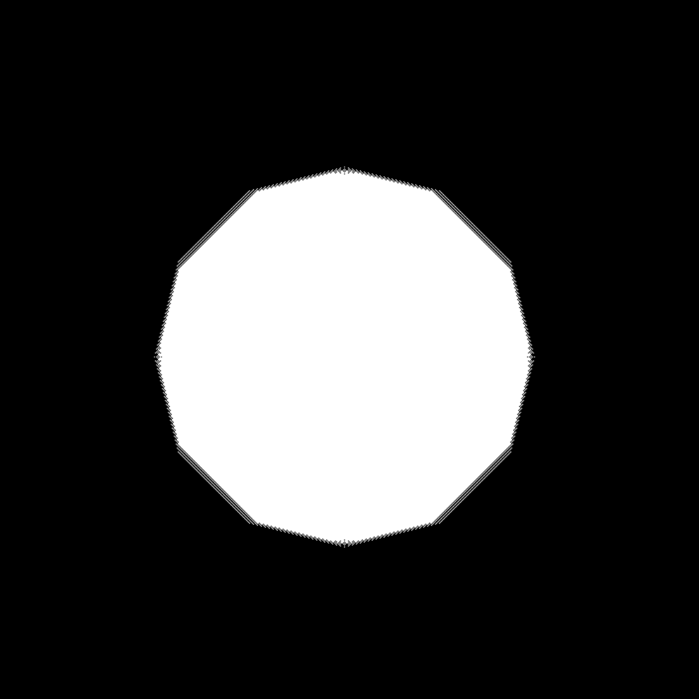

## Описание проекта

Данный репозиторий представляет собой веб-приложение, разработанное для поисково-спасательного отряда «ЭКСТРЕМУМ». Основная задача приложения заключается в обеспечении инструментов для организации и проведения поисковых операций в лесной местности. Оно основывается на практическом опыте и методических материалах, разработанных специалистами данного отряда.

Ключевой особенностью приложения является его способность оценивать возможные маршруты и расстояния, которые мог преодолеть пропавший человек, с учетом различных факторов. Приложение использует средние значения скорости передвижения по лесной местности и формулу расчета дистанции с учетом понижающих коэффициентов.

## Структура и функциональность веб-приложения

Веб-приложение разработано на фреймворке **Flask** и предназначено для расчета возможной зоны нахождения пропавшего человека.

#### Основные элементы приложения:

1. **Форма ввода данных**  
   Приложение предоставляет пользователю форму для ввода информации, необходимой для расчета зоны поиска пропавшего человека. Основные параметры включают:
   - **Дата и время потери** — момент, когда человек был замечен в последний раз.
   - **Текущие дата и время** — актуальное время на момент проведения поисковой операции.
   - **Возраст, пол, физическое и психическое состояние** — данные, которые могут влиять на скорость и направление передвижения пропавшего.
   - **Географические координаты** — широта и долгота центра поисково-спасательных работ и предполагаемого местонахождения человека.

2. **Дополнительные данные**
   Для повышения точности расчетов пользователи имеют возможность раскрыть раздел с дополнительной информацией:
   - **Характеристики потерявшегося**: опыт нахождения в дикой природе, знание местности, наличие телефона, моральные обязательства и внешние сигналы.
   - **Характеристики местности**: проходимость, кривизна и угол наклона, которые оказывают влияние на расчет понижающих коэффициентов.

3. **Получение данных о погоде**  
   Веб-приложение автоматически извлекает информацию о погоде для заданной даты и времени, используя HTTP-запросы.

4. **Карта и визуализация**  
   После ввода данных картографический сервис Leaflet.js интегрируется в приложение ля отображения предполагаемой зоны поиска на карте.

5. **Отчёты и результаты**  
   Результаты расчётов отображаются в специальной области на экране. Отчет включает информацию о расчётах для каждого дня и временного интервала, включая:
   - **Интервал времени** — продолжительность, в течение которой рассматриваются возможные перемещения пропавшего человека.
   - **Расстояние, пройденное человеком** — оценка дистанции, которую мог преодолеть пропавший за указанный интервал.
   - **Погодные условия** — информация о погоде в указанные временные интервалы.

## Структура нейросетевой модели для сегментации изображений

Нейросеть разработана для сегментации изображений с целью выделения зон поиска пропавшего человека на карте. Она идентифицирует области, такие как леса, поля и водоёмы, что способствует более точному анализу местности.

Архитектура модели основана на **U-Net** и обрабатывает изображения используя библиотеки TensorFlow и Keras.

#### Input Layer
Входной слой принимает изображения размером 256x256 пикселей с 3 цветовыми каналами (RGB).

#### Skip Connections
Пропускные связи (skip connections) объединяют выходы разных уровней сети. Такие архитектуры, как U-Net, используют эти связи для передачи информации с ранних слоёв на поздние, что помогает восстанавливать пространственные данные.

#### Sequential Блоки
Свёрточные блоки поочередно уменьшают разрешение изображения и увеличивают количество каналов (например, с 64 до 512). Это характерно для многослойной архитектуры, которая постепенно выделяет высокоуровневые признаки на каждом этапе.

#### Concatenate Layers
Слои объединения (concatenate) используют выходы разных уровней. Это позволяет восстанавливать потерянные пространственные данные на более поздних этапах за счёт передачи информации с ранних уровней.

#### Conv2DTranspose
Финальный слой применяет транспонированную свёртку (Conv2DTranspose), которая увеличивает разрешение выхода обратно до 256x256. Этот слой используется для восстановления исходного разрешения изображения, что особенно важно в задачах сегментации или генерации изображений.

### Результат работы нейросетевой модели

|  |  |
|----------------------------------------|----------------------------------------|

## Алгоритм обработки изображения после сегментации

Алгоритм обработки изображения после сегментации предназначен для определения области, которую может пройти пропавший человек, с целью выявления зон его поиска. 

В данной реализации используются библиотеки OpenCV и NumPy.

#### Очередь BFS
Алгоритм поиска в ширину (BFS) стартует с центральной точки изображения. Очередь хранит координаты текущей точки и время, затраченное на её достижение.

#### Расширение области
Для каждой точки осуществляется проверка соседних пикселей (вверх, вниз, влево, вправо и по диагоналям). Если соседний пиксель не посещён и доступен для перемещения, он добавляется в очередь для дальнейшей обработки.

> **Примечание:** Традиционный подход, основанный на «Манхэттенском расстоянии», ограничивал движение четырьмя направлениями: вверх, вниз, влево и вправо. В новой модели реализована возможность движения по траектории, аналогичной пиксельной окружности, что более точно отражает реальные условия передвижения.

|  |  |
|----------------------------------------|----------------------------------------|

#### Учет Скорости
Скорость прохождения пикселя зависит от его цвета:
- Зелёные пиксели (лес) замедляют движение, увеличивая время прохождения.
- Голубые пиксели (озеро) делают движение невозможным (скорость равна 0), блокируя путь.

#### Завершение По Времени
Процесс продолжается, пока не будет достигнут лимит времени, установленный переменной `total_time`.

#### Маска
Пройденные пиксели добавляются в маску, которая в результате отобразит зону, покрытую за отведённое время.

#### Визуализация
Маска представляет собой область, которую человек смог пройти за указанный период, обходя непроходимые зоны и замедляясь в сложных участках. Визуально маска будет напоминать деформированный круг, где форма зависит от встреченных препятствий.

### Результат работы алгоритма

|  |  |
|----------------------------------------|----------------------------------------|